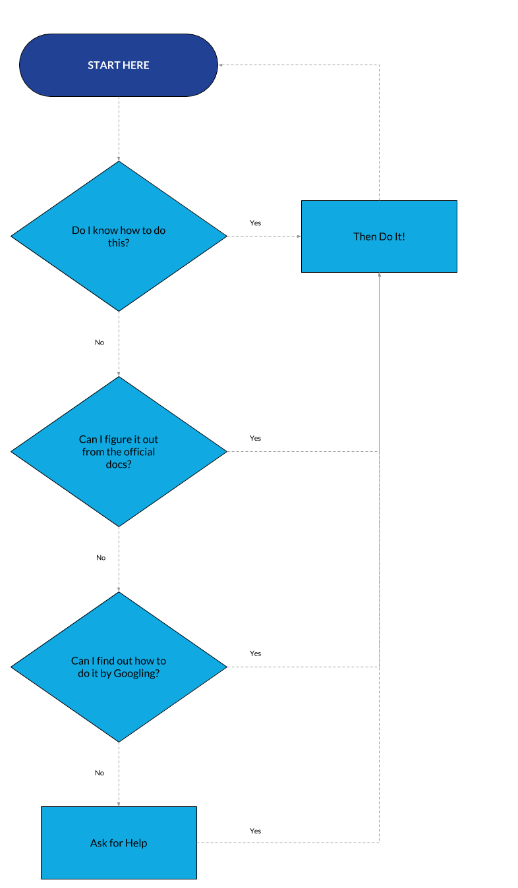

# **Roadmap to Application to Android Development**

### Since this is a roadmap, we will study the fundamentals through the following different topics to master this topic:

> *What programming Language Should You Learn*

> *Where Can you learn about your selected Language*

## **what is app/application?**

> An App/Application is software that can be installed and run on a computer, tablet, smartphone, etc.

## **What is Android, and where does it come from?**

> Android is an open-source operating system based on the Linux kernel and used in mobile devices like smartphones, tablets, etc. Android has been one of the best-selling OS for smartphones. Android OS was developed by Android Inc. before Google bought the company in 2005. Various applications like games, music players, cameras, etc. are built for these smartphones which run on Android. Google Play Store features quite 3.3 million apps. Today, Android remains dominant on a global scale. Approximately 75% of the world population prefers using Android against iOS. It is an operating system that has a huge market for apps.
### **Now, we are familiar with the word app and Android.**

## **why Android Development?**

It is time to set your goals. What is your goal for your android development:-

>- It might be for academic purposes, for making college projects
>- It might be for your long-term career
>- It might be for teaching purposes. In this case, learning Android development to teach others

> **_How to choose and What to choose as your language?_** 

> **Java**

> > Java is an official programming language of Android development and is supported by Android Studio. It has been an official language longer than Kotlin. Java is also popular outside of Kotlin development for many other purposes. Java and Android Studio have steep learning curves.

> **Kotlin**

> > Kotlin is another official Android language. It is similar to Java in many ways but is a little easier to get your head around. It is also now Google’s preferred language of choice, though it is not as widely used outside of Android Studio. This fact may make it slightly less appealing for those hoping to work as developers across numerous projects.

>  **Dart Programming**

> > Dart is an open-source general-purpose programming language developed by Google. It supports application development on both client and server-side. But is widely used for the development of Android apps, ios apps, IoT, and web applications using the Flutter Framework.

>  **C++**

> > Android Studio also supports C++ with the use of the Java NDK. This allows for native coding applications, which can be handy for things like games. C++ is more complicated though, and this option is mostly only going to appeal to large, professional teams. C++ is also supported by Unreal Engine.

>  **C#**

> > C# is a more beginner-friendly alternative to C or C++ that obfuscates more code. It is also a little less difficult than Java, though the two languages are extremely similar. It’s supported by some very handy tools like Unity and Xamarin, which are great for game development and cross-platform development. C# with Unity is the best option for many mobile game developers.

<!--  -->

## **In this RoadMap we will be discussing Java, Kotlin, and Dart**

### **_Java_**

Firstly Java was the official language for Android App Development (but now it was replaced by Kotlin) and consequently, it is the most used language as well. Many of the apps in the Play Store are built with Java, and it is also the most supported language by Google. In addition to all this, Java has a great online community for support in case of any problems (And trust me, there will be problems!).
However, Java is a complicated language for a beginner to use as it contains complex topics like constructors, null pointer exceptions, concurrency, checked exceptions, etc. Also, The Android Software Development Kit (SDK) increases the complexity to a new level!
All in all, Java is a great language to experience the full joys of Android App Development. However, it may be a little complex for beginners who prefer to start with something more manageable and then return to it

#### **Resources to learn:**

> [Udemy](https://www.udemy.com/share/103nJu/)

> [FreeCodeCamp](https://youtu.be/fis26HvvDII)

### **_Kotlin_**

Now Kotlin is the official language for Android App Development declared by Google in 2019. Kotlin is a cross-platform programming language that may be used as an alternative to Java for Android App Development. It has also introduced as a secondary “official” Java language in 2017. Kotlin can interoperate with Java and it runs on the Java Virtual Machine.
The only sizable difference is that Kotlin removes the superfluous features of Java such as null pointer exceptions. It also removes the necessity of ending every line with a semicolon. In short, Kotlin is much simpler for beginners to try as compared to Java and it can also be used as an “entry point” for Android App Development.

#### **Resources to learn:**

> [Udacity](https://www.udacity.com/course/developing-android-apps-with-kotlin--ud9012)

> [Google Developers](https://developer.android.com/courses/android-basics-kotlin/course)

### **_Dart_**

Dart is an open-source programming language that powers the Flutter framework, which is getting a lot of traction these days because of its ability to deliver beautiful and performance apps for the web, desktop, and mobile in lesser time. The key selling point of dart is that it is designed by Google as a client-optimized language for fast apps on any platform. Dart mainly focuses on making UI development easier for developers with features such as hot-reload, which lets developers see changes instantly while working on the app. Dart is also known for its fast performance, it compiles to ARM and x64 machine code for mobile, desktop, and backend. Flutter is a cross-platform app development framework, Flutter is more cost-effective. It meets all the requirements of every company, regardless of its model and size.

#### **Resources to learn:**

> [FreeCodeCamp](https://youtu.be/VPvVD8t02U8)

> [Udemy](https://www.udemy.com/share/101WB6/)

## **Getting Familiar With Android Studio**

It’s better to know your tools before you are going to use it. Android Studio is the official Integrated Development Environment for Google’s Android operating system, built on JetBrains’ IntelliJ IDEA software and designed specifically for Android development.

### **_File Structure:_**

> AndroidManifest.xml file
> Java file
> Drawable file
> Layout file
> mipmap file
> colors.xml file
> strings.xml file
> styles.xml file
> build.gradle(Module: app) file

### **_Android Studio Overview:_**

> Create a new project
> Reopen, close, and save the project
> Create a new activity, classes, drawable resource files
> Run the app on AVD of Emulator or in a real device etc.

## **Android Operating system**

The foundation of the Android Platform is the Linux Kernel, which allows Android to take advantage of certain security features. The Linux kernel has been used in millions of security-sensitive systems since its creation in 1991, so it has a long history of consistently being researched, tested, and improved upon by thousands of developers.

> According to the android Docs, Android utilizes several key Linux security features including:
> A user-based permissions model
> Process isolation
> An extensible mechanism for secure inter-process communication (IPC)
> The ability to remove unnecessary and/or insecure parts of the kernel

## **Conclusion**

This concludes the RoadMap to Android Development. From why to learn where to start and how to start. From choosing a language for the Development and benefits of using that language
Again, don't be intimidated by the amount of information on this roadmap. Check out the sections that would be the most helpful to you to understand Android development, as “the more Research the more you Learn”.
Also, you don’t have to learn all there is to know about the Android operating system. However, understanding the overall Android platform architecture will help you to build better Android applications.
