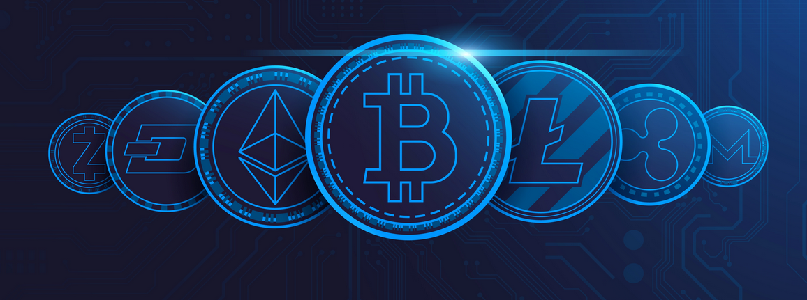
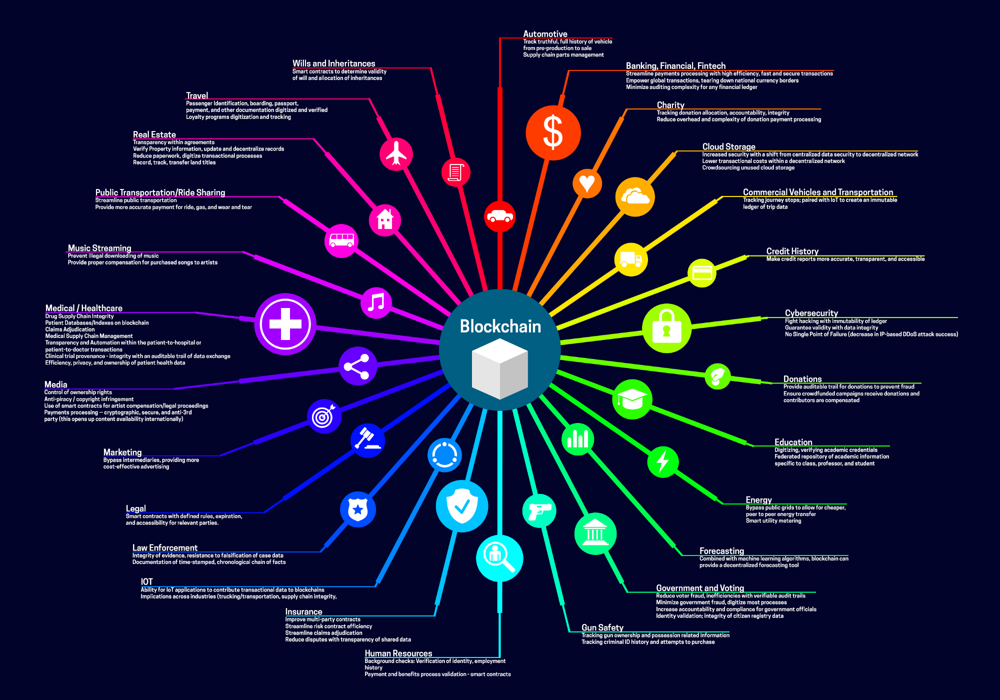

<h1 align="center">
 
   
  Blockchain Guide
</h1>
A guide covering Blockchain including the applications and tools that will make you a better and more efficient Blockchain developer.
The blockchain is an incorruptible digital ledger of economic transactions that can be programmed to record not just financial transactions but virtually everything of value (by [Debjit Purohit])

## Basic Introduction

<!--    
### Encryption knowledge
   -->

-   **Encryption knowledge**  
    * [Basic concepts](https://www.jianshu.com/p/a044b303f7d5) - Asymmetric encryption, Digital signature, Certificate  
    * [Digital signature extension](https://www.jianshu.com/p/410e77ec23fa)  - Multi-signature, Blind signature, Group signature, Ring signature
    * [Merkle tree](https://www.jianshu.com/p/a044b303f7d5)  
    <!-- * [Merkle tree in blockchain](./Basic/merkle_tree_in_blockchain.md)   -->
    * [Merkle DAG](http://www.sohu.com/a/247540268_100222281)   
    * [**CryptoNote v2.0**](https://cryptonote.org/whitepaper.pdf) - Untraceable Transactions and Egalitarian Proof-of-work
<!--   
### Consensus
    -->
-   **Consensus**  
    * [Proof of Work](https://www.jianshu.com/p/3462f2ed74d7)
    * [Proof of Stake](https://www.jianshu.com/p/2fd3bce523b0)
    * [Proof of Stake FAQs](https://github.com/ethereum/wiki/wiki/Proof-of-Stake-FAQs) / [Chinese version](https://ethfans.org/posts/Proof-of-Stake-FAQ-new-2018-3-15)
    * [Delegated Proof of Stake](https://www.jianshu.com/p/ccc3fff7a60d)
    * [Practical Byzantine Fault Tolerance](https://www.jianshu.com/p/e991c1385f9f)

<!--    
### Account and transaction model
    -->
-   **Account and transaction model**  
    * [UTXO model](https://www.jianshu.com/p/2f4e75dbc2e4)
<!--
### Exchange
    -->
-   **Exchange**  
<!--
### Applications
    -->
-   **Applications**  
    * [Do You Need a Blockchain?](https://spectrum.ieee.org/computing/networks/do-you-need-a-blockchain)  
    * [What can't blockchain do?](https://www.jianshu.com/p/70f6a29a6296)  
    * [More](./Extension/application.md)
<!--     
### Governance
    -->
-   **Governance**
    * [Blockchains should not be democracies](https://haseebq.com/blockchains-should-not-be-democracies/)                                       
<!-- *    -->

<!--     
### Digital currency ranking
    -->
-   **[Digital currency ranking](https://coinmarketcap.com/)**   
---

## Development 

### [BitCoin](https://github.com/bitcoin/bitcoin)

**Bitcoin** is an experimental digital currency that enables instant payments to anyone, anywhere in the world. Bitcoin uses **peer-to-peer** technology to **operate with no central authority**: managing transactions and issuing money are carried out collectively by the network.

-   [BitCoin white paper: A Peer-to-Peer Electronic Cash System](https://bitcoin.org/bitcoin.pdf) / [Chinese version](BitCoin/white%20paper.md) / [Annotated BitCoin white paper](https://fermatslibrary.com/s/bitcoin)
-   [Mastering BitCoin](https://github.com/bitcoinbook/bitcoinbook) / [Chinese version](http://book.8btc.com/books/6/masterbitcoin2cn/_book/) / [pdf download](http://book.8btc.com/master_bitcoin?export=pdf)
-   [Bitcoin Improvement Proposals (BIPs)](https://github.com/bitcoin/bips/)

+   [But how does bitcoin work?](https://www.youtube.com/watch?v=bBC-nXj3Ng4)
+   [Mining visualization](http://www.yogh.io/#mine:last)
+   [Wallets](./BitCoin/awesome.md#wallets-api)
+   [Explorers](./BitCoin/awesome.md#blockchain-explorers)
+   [Libraries](./BitCoin/awesome.md#libraries) - C++, JavaScript, PHP, Ruby, Python, Java, .Net
+   [Web services](./BitCoin/awesome.md#blockchain-api-and-web-services)
+   [Full nodes](./BitCoin/awesome.md#full-nodes)
+   [More](./BitCoin/awesome.md)

### [Ethereum](https://github.com/ethereum)

**Ethereum** is a **decentralized platform that runs smart contracts**: applications that run exactly as programmed without any possibility of downtime, censorship, fraud, or third-party interference.

These apps run on a custom-built **blockchain, an enormously powerful shared global infrastructure that can move value around and represent the ownership of property.**

-   [Ethereum white paper](https://github.com/ethereum/wiki/wiki/White-Paper) / [Chinese version](./Ethereum/white%20paper.md) / [Annotated Ethereum white paper](https://fermatslibrary.com/s/ethereum-a-next-generation-smart-contract-and-decentralized-application-platform)
-   [Mastering Ethereum](https://github.com/ethereumbook/ethereumbook) / [Chinese version](https://github.com/inoutcode/ethereum_book)
-   [Ethereum Yellow Paper](https://ethereum.github.io/yellowpaper/paper.pdf) / [Chinese version](https://github.com/yuange1024/ethereum_yellowpaper)
-   [Ethereum wiki](https://github.com/ethereum/wiki/wiki)
    -   [Ethereum Design Rationale](https://github.com/ethereum/wiki/wiki/Design-Rationale) / [Chinese version](https://ethfans.org/posts/510)
    -   [Ethereum problems](https://github.com/ethereum/wiki/wiki/Problems)
    -   [Sharding roadmap](https://github.com/ethereum/wiki/wiki/Sharding-roadmap)
    -   [**Ethereum flavored WebAssembly (ewasm)**](https://github.com/ewasm)
    -   [ÐΞVp2p Wire Protocol](https://github.com/ethereum/wiki/wiki/%C3%90%CE%9EVp2p-Wire-Protocol)
    -   [EVM-Awesome-List](https://github.com/ethereum/wiki/wiki/Ethereum-Virtual-Machine-(EVM)-Awesome-List)
    -   [Patricia Tree](https://github.com/ethereum/wiki/wiki/Patricia-Tree)
    -   Consensus
        -   [Ethash](https://github.com/ethereum/wiki/wiki/Ethash)
        -   [Ethash-DAG](https://github.com/ethereum/wiki/wiki/Ethash-DAG)
        -   [Ethash Specification](https://github.com/ethereum/wiki/wiki/Ethash)
        -   [Mining Ethash DAG](https://github.com/ethereum/wiki/wiki/Mining#ethash-dag)
        -   [Dagger-Hashimoto Algorithm](https://github.com/ethereum/wiki/blob/master/Dagger-Hashimoto.md)
        -   [DAG Explanation and Images](https://ethereum.stackexchange.com/questions/1993/what-actually-is-a-dag)
        -   [Ethash in Ethereum Yellowpaper](https://ethereum.github.io/yellowpaper/paper.pdf#appendix.J)
        -   [Ethash C API Example Usage](https://github.com/ethereum/wiki/wiki/Ethash-C-API)
-   [Accounts, Transactions, Gas, and Block Gas Limits in Ethereum](https://hudsonjameson.com/2017-06-27-accounts-transactions-gas-ethereum/)
-   [Ethereum Improvement Proposals](https://eips.ethereum.org/)
-   [Important EIPs and ERCs](https://github.com/ethereumbook/ethereumbook/blob/develop/appdx-standards-eip-erc.asciidoc#table-of-most-important-eips-and-ercs) / [EIP list](https://github.com/ethereum/EIPs)
-   Security
    -   [Ethereum Smart Contract Security Best Practices](https://consensys.github.io/smart-contract-best-practices/) / [Chinese version](https://github.com/ConsenSys/smart-contract-best-practices/blob/master/README-zh.md)
    -   [Onward with Ethereum Smart Contract Security](https://blog.zeppelin.solutions/onward-with-ethereum-smart-contract-security-97a827e47702)
    -   [The Hitchhiker's Guide to Smart Contracts in Ethereum](https://blog.zeppelin.solutions/the-hitchhikers-guide-to-smart-contracts-in-ethereum-848f08001f05)
    -   [**OpenZeppelin**](https://docs.openzeppelin.com/openzeppelin/)
    -   [**openzeppelin contracts**](https://github.com/OpenZeppelin/openzeppelin-contracts) / [doc](https://docs.openzeppelin.com/contracts/2.x/)
    -   [openzepplin sdk](https://github.com/OpenZeppelin/openzeppelin-sdk)
-   Token
    -   [ERC20](https://github.com/ethereum/EIPs/blob/master/EIPS/eip-20.md) / [impl](https://github.com/OpenZeppelin/openzeppelin-contracts/tree/master/contracts/token/ERC20)
    -   [ERC721](https://github.com/ethereum/EIPs/blob/master/EIPS/eip-721.md) / [impl](https://github.com/OpenZeppelin/openzeppelin-contracts/tree/master/contracts/token/ERC721)

+   Utils
    +   [Ethereum Blockchain Explorer](https://etherscan.io/)
    +   [Eth Gas Station](https://ethgasstation.info/)
    +   [Eth Network Status](https://ethstats.net/)
    

-   [**EEA** - Enterprise Ethereum: Private Blockchain For Enterprises](https://101blockchains.com/enterprise-ethereum/)
    -   [What Is Enterprise Ethereum?](https://101blockchains.com/enterprise-ethereum/#1)
    -   [What is The Enterprise Ethereum alliance?](https://101blockchains.com/enterprise-ethereum/#2)
    -   [Benefits of Enterprise Ethereum](https://101blockchains.com/enterprise-ethereum/#3)
    -   [Architecture Stack of the Enterprise Ethereum Blockchain](https://101blockchains.com/enterprise-ethereum/#4)
    -   [What Are The Possible Enterprise Ethereum Use Cases?](https://101blockchains.com/enterprise-ethereum/#5)
    -   [Ethereum Blockchain as a Service Provider](https://101blockchains.com/enterprise-ethereum/#6)
    -   [Real-World Companies Using Enterprise Ethereum](https://101blockchains.com/enterprise-ethereum/#7)
    -   [Final Words](https://101blockchains.com/enterprise-ethereum/#8)

### Consortium Blockchain
*   **Theory**
    -   [**The Byzantine Generals Problem**](https://people.eecs.berkeley.edu/~luca/cs174/byzantine.pdf)
    -   [**Practical Byzantine Fault Tolerance**](http://pmg.csail.mit.edu/papers/osdi99.pdf)
    -   [Is consortium blockchain better?](http://www.infoq.com/cn/news/2018/10/is-consortium-blockchain-better)   
    -   [5 consortium blockchain comparison](http://www.infoq.com/cn/articles/5-consortium-blockchain-comparison) / [quick version](https://upload-images.jianshu.io/upload_images/11336404-f753396df0e930c8.jpg?imageMogr2/auto-orient/strip%7CimageView2/2/w/1240)    
    -   [FISCO BCOS vs Fabric](http://www.infoq.com/cn/news/2018/09/uncover-consortium-blockchain)   

*   **Implement a consortium blockchain using Ethereum**  
    -   [Building a Private Ethereum Consortium](https://www.microsoft.com/developerblog/2018/06/01/creating-private-ethereum-consortium-kubernetes/)
    -   [Deploying a private Ethereum blockchain to Microsoft Azure Cloud](https://www.youtube.com/watch?v=HsConsFaZG8)
    -   [Ethereum Consortium Network Deployments Made Easy](https://github.com/CatalystCode/ibera-ethereum-consortium-blockchain-network)
    -   [How to Set Up a Private Ethereum Blockchain in 20 Minutes](https://arctouch.com/blog/how-to-set-up-ethereum-blockchain/)

#### Hyperledger

-   [Hyperledger Org](https://wiki.hyperledger.org/)
-   Fabric
    -   [Fabric Org](https://wiki.hyperledger.org/display/Fabric)
    -   [Fabric Design Documents](https://wiki.hyperledger.org/display/fabric/Design+Documents)
    -   [Fabric Wiki](https://hyperledger-fabric.readthedocs.io/en/latest/)
        -   1.4 [En](https://hyperledger-fabric.readthedocs.io/en/release-1.4/) / [Zn](https://hyperledger-fabric.readthedocs.io/zh_CN/release-1.4/) / [Release](https://hyperledger-fabric.readthedocs.io/_/downloads/en/release-1.4/pdf/)
        -   2.2 [En](https://hyperledger-fabric.readthedocs.io/en/release-2.2/) / [Zn](https://hyperledger-fabric.readthedocs.io/zh_CN/release-2.2/)
    -   [Fabric Source Code Analyse](https://yeasy.gitbook.io/hyperledger_code_fabric/overview)
    -   [A Kafka-based Ordering Service for Fabric](https://docs.google.com/document/d/19JihmW-8blTzN99lAubOfseLUZqdrB6sBR0HsRgCAnY/edit)

-   Explorer
    -   [Explorer Proposal](https://docs.google.com/document/d/1GuVNHZ5Jqq-gTVKflnZ1YiJfEoozvugqenC6QEQFQj4/edit)
    -   [Explorer doc](https://blockchain-explorer.readthedocs.io/en/master/architecture/index.html)

-   [IBM OpenTech Hyperledger Fabric 1.4 LTS Course](https://space.bilibili.com/102734951/channel/detail?cid=69148)
-   [edx: Introduction to Hyperledger Blockchain Technologies Free Course](https://www.edx.org/course/introduction-to-hyperledger-blockchain-technologie)

#### [XuperChain](https://github.com/xuperchain/xuperchain)

**XuperChain**, the first open-source project of XuperChain Lab, introduces a highly flexible blockchain architecture with great transaction performance.

**XuperChain** is the underlying solution for union networks with the following highlight features:

**High Performance**
*   Creative XuperModel technology makes contract execution and verification run parallelly.
*   [TDPoS](https://xuperchain.readthedocs.io/zh/latest/design_documents/xpos.html) ensures quick consensus in a large scale network.
*   WASM VM using AOT technology.

**Solid Security**
*   Contract account protected by multiple private keys ensures assets safety.
*   [Flexible authorization system](https://xuperchain.readthedocs.io/zh/latest/design_documents/permission_model.html) supports weight threshold, and AK sets, and could be easily extended.

**High Scalability**
*   Robust [P2P](https://xuperchain.readthedocs.io/zh/latest/design_documents/p2p.html) network supports a large-scale network with thousands of nodes.
*   Branch management on the ledger makes automatic convergence consistency and supports global deployment.

**Multi-Language Support**: Support pluggable multi-language contract VM using [XuperBridge](https://xuperchain.readthedocs.io/zh/latest/design_documents/XuperBridge.html) technology.

**Flexibility**: Modular and pluggable design provides high flexibility for users to build their blockchain solutions for various business scenarios.

-   [Baidu Blockchain Engine](https://cloud.baidu.com/product/bbe.html)
-   [Homepage](https://xchain.baidu.com/)
-   [Doc](https://xuperchain.readthedocs.io/zh/latest/index.html)
-   [Wiki](https://github.com/xuperchain/xuperchain/wiki) / [English version](https://github.com/xuperchain/xuperchain/wiki/Wiki-in-English)

+   [Getting start](https://github.com/xuperchain/xuperchain/wiki/3.-Getting-Started)
    +   [Account operation](https://xuperchain.readthedocs.io/zh/latest/advanced_usage/contract_accounts.html)
    +   [Multiple nodes deployment](https://xuperchain.readthedocs.io/zh/latest/advanced_usage/multi-nodes.html)
    +   [Wasm contract](https://xuperchain.readthedocs.io/zh/latest/advanced_usage/create_contracts.html)
    +   [Proposal](https://xuperchain.readthedocs.io/zh/latest/advanced_usage/initiate_proposals.html)
    +   [Parallel chain](https://xuperchain.readthedocs.io/zh/latest/advanced_usage/parallel_chain.html)
+   SDK
    +   [Go SDK](https://github.com/xuperchain/xuper-java-sdk)
    +   [Javascript SDK](https://github.com/xuperchain/xuper-sdk-js)
    +   [Java SDK](https://github.com/xuperchain/xuper-python-sdk)
    +   [Python SDK](https://github.com/xuperchain/xuper-python-sdk)
+   [Detailed FAQs](https://xuperchain.readthedocs.io/zh/latest/FAQs.html)
+   [Comparation with Fabric and Ethereum](https://github.com/xuperchain/xuperchain/wiki/%E9%99%84-%E8%AF%84%E6%B5%8B%E6%95%B0%E6%8D%AE%E5%AF%B9%E6%AF%94)

#### [FISCO-BCOS](https://github.com/FISCO-BCOS/Wiki)
## Related Tools

### Solidity
-   [doc](https://solidity.readthedocs.io/en/develop/index.html) / [Chinese version](https://solidity-cn.readthedocs.io/zh/develop/)

### truffle
-   [BlockChain KickStarter From Scratch](https://prasannabrabourame.medium.com/blockchain-kickstarter-from-scratch-9a3906596cd0)

### web3.js
-   [doc](https://web3js.readthedocs.io/en/1.0/) / [Chinese version](http://web3.tryblockchain.org/Web3.js-api-refrence.html)

## Implementation of Blockchain
-   [**C#**: _Programming The Blockchain in C#_](https://programmingblockchain.gitbooks.io/programmingblockchain/)
-   [**C++**: _Blockchain from Scratch_](https://github.com/openblockchains/awesome-blockchains/tree/master/blockchain.cpp)
-   [**Go: _Building Blockchain in Go_**](https://github.com/Jeiwan/blockchain_go) / [Chinese version 1](https://github.com/liuchengxu/blockchain-tutorial/blob/master/content/part-1/basic-prototype.md) / [Chinese version 2](https://zhangli1.gitbooks.io/dummies-for-blockchain/content/)
  
-   [**Go**: _Building A Simple Blockchain with Go_](https://www.codementor.io/codehakase/building-a-simple-blockchain-with-go-k7crur06v)
-   [**Go**: _Code your own blockchain in less than 200 lines of Go_](https://medium.com/@mycoralhealth/code-your-own-blockchain-in-less-than-200-lines-of-go-e296282bcffc)
-   [**Java**: _Creating Your First Blockchain with Java_](https://medium.com/programmers-blockchain/create-simple-blockchain-java-tutorial-from-scratch-6eeed3cb03fa)
-   [**Java**: _Write a blockchain with java_](https://www.jianshu.com/p/afd8c465c91a)
-   [**JavaScript**: _A cryptocurrency implementation in less than 1500 lines of code_](https://github.com/conradoqg/naivecoin)
-   [**JavaScript**: _A web-based demonstration of blockchain concepts_](https://github.com/anders94/blockchain-demo/)
-   [**Kotlin**: _Let’s implement a cryptocurrency in Kotlin_](https://medium.com/@vasilyf/lets-implement-a-cryptocurrency-in-kotlin-part-1-blockchain-8704069f8580)
-   [**Python**: _A Practical Introduction to Blockchain with Python_](http://adilmoujahid.com/posts/2018/03/intro-blockchain-bitcoin-python/)
-   [**Python**: _Build your own blockchain: a Python tutorial_](http://ecomunsing.com/build-your-own-blockchain)
-   [**Ruby**: _lets-build-a-blockchain_](https://github.com/Haseeb-Qureshi/lets-build-a-blockchain)
-   [**Ruby**: _Programming Blockchains Step-by-Step (Manuscripts Book Edition)_](https://github.com/yukimotopress/programming-blockchains-step-by-step)
-   [**Scala**: _How to build a simple actor-based blockchain_](https://medium.freecodecamp.org/how-to-build-a-simple-actor-based-blockchain-aac1e996c177)
-   [**TypeScript**: _Naivecoin: a tutorial for building a cryptocurrency_](https://lhartikk.github.io/)
    -   [_Minimal working blockchain_](https://lhartikk.github.io/jekyll/update/2017/07/14/chapter1.html)
    -   [_Proof of Work_](https://lhartikk.github.io/jekyll/update/2017/07/13/chapter2.html)
    -   [_Transactions_](https://lhartikk.github.io/jekyll/update/2017/07/12/chapter3.html)
    -   [_Wallet_](https://lhartikk.github.io/jekyll/update/2017/07/11/chapter4.html)
    -   [_Transaction relaying_](https://lhartikk.github.io/jekyll/update/2017/07/10/chapter5.html)
    -   [_Wallet UI and blockchain explorer_](https://lhartikk.github.io/jekyll/update/2017/07/09/chapter6.html)
-   [**TypeScript**: _NaivecoinStake: a tutorial for building a cryptocurrency with the Proof of Stake consensus_](https://naivecoinstake.learn.uno/)

---

### Applications

#### Identity Applications

##### Public Blockchain Identity

-   [Blockstack](https://blockstack.org) - Platform for decentralized, server-less apps where users control their data. Identity included.
-   [Evernym](http://www.evernym.com) - Self-Sovereign identity built on top of an open source permissioned blockchain.
-   [Jolocom](https://jolocom.com) - Self-sovereign identity wallet.
-   [SIN](https://en.bitcoin.it/wiki/Identity_protocol_v1) - Proposed identity protocol for BitCoin.
-   [uPort](https://www.uport.me) - Self-Sovereign identity on [Ethereum](https://ethereum.org) by [ConsenSys](https://consensys.net).

##### Blockchain as a collateral

-   [ShoCard](https://shocard.com) - Proprietary digital identity service, that uses blockchain for time-stamping and secure document exchange.
-   [Tradle](https://tradle.io/) - Makes a bank on blockchain, identity as collateral.

##### Unclear

-   [KYC Chain](http://kyc-chain.com) - Secure platform for sharing verifiable identity claims, data, or documents among financial institutions.
-   [ObjectChain Collab](http://www.objectchain-collab.com) - Cross-industry collaboration over distributed identity.
-   [UniquID](http://uniquid.com) - Identity both for people and devices.
-   [Vida Identity](https://vidaidentity.com) - Enterprise-grade Blockchain Identity Software.

##### Guidance

-   [ID3](https://idcubed.org) - Institute for Data Driven Design, explores issues around self-sovereign identity, and distributed organizations.
-   [OpenCreds](http://opencreds.org) - W3C Credentials Community Group.
-   [TAO Network Identity](http://tao.network/portfolio-item/the-identity-system/) - Description of blockchain identity by Tao.Network.

#### Internet of Things Applications

-   [Chronicled](http://www.chronicled.com) - IoT devices registry on blockchain.
-   [Filament](http://filament.com) - Software and hardware for decentralized Intranet of Things systems
-   [IOTA](http://www.iotatoken.com) - Decentralized Internet of Things token on blockless blockchain.
-   [Machinomy](http://machinomy.com) - Distributed platform for IoT micropayments.
-   [Project Oaken](https://www.projectoaken.com) - IoT blockchain platform.
-   [Slock.it](https://slock.it) - Ethereum-based platform for building Shared Things.

#### Energy Applications

-   [bankymoon](http://bankymoon.co.za/) - Blockchain consultancy. [Presented](http://goo.gl/L6vJBx) bitcoin-topped smart electricity meter. Once topped up, it chooses a plan and starts moving energy.
-   [Co-Tricity](https://co-tricity.com/) - Decentralised energy marketplace by [Innogy](https://innovationhub.innogy.com/) and [ConsenSys](https://consensys.net).
-   [Electron](http://www.electron.org.uk/) - Reinventing energy on blockchain.
-   [GridSingularity](http://gridsingularity.com) - Blockchain for Smart Grid. Declare three years of work on the technology.
-   [lo3 energy](http://lo3energy.com) - Energy Services, Product Research & Development. Makers of [Brooklyn Microgrid](http://brooklynmicrogrid.com) along with [ConsenSys](https://consensys.net).
-   [lumo](https://lumoenergy.com.au) - Energy provider. Experiment with blockchain.
-   [PowerLedger](https://powerledger.io) - Decentralised energy marketpace.
-   [PowerPeers](https://www.powerpeers.nl/) - Peer-to-peer energy marketplace in the Netherlands.
-   [Solar Change](http://www.solarchange.co/) - Makers of [Solar Coin](http://solarcoin.org/). AltCoin for a MW of solar power.
-   [Terraledger](https://terraledger.com) - Provider of Renewable Energy Certificates.
-   [ImpactPPA](https://impactppa.com) - Reinvesting of power generated under Power Purchase Agreement in more PPAs.

#### Media and Journalism

-   [Steem](https://steem.io) - Decentralized social network which incentivises content creation and curation.
-   [PopChest](https://popchest.com) - Incentivized distributed video platform.
-   [Civil](https://joincivil.com) - Decentralized newsmaking platform.

#### DeFi (Decentralised Finance)

-   [Uniswap](https://uniswap.org) - Decentralized exchange powered by the Automated Market Maker model (AMM).
-   [Compound](https://compound.finance) - Decentralized lending and borrowing.
-   [1inch Exchange](https://1inch.exchange) - Get the best rates among multiple DEXes.
-   [Synthetix](https://synthetix.io/) - Protocol for synthetic assets.

+   Tools
    +   [Defi Dashboard](https://debank.com/): portfolio tracker, project lists, rankings, etc.
    +   [Zapper](https://zapper.fi/): dashboard for viewing and managing your DeFi investments.
    +   [Furucombo](https://furucombo.app/): easily create flash loans without writing a single line of code.
    +   [Covalent](https://www.covalenthq.com/): a unified API bringing visibility to billions of blockchain data points.
---
### Books

-   [**Blockchain guide**](https://yeasy.gitbooks.io/blockchain_guide/content/) by Baohua Yang, 2017 --
    Introduce blockchain-related technologies, from theory to practice with bitcoin, Ethereum, and hyper ledger.
    <!-- -   [区块链原理、设计与应用](https://github.com/yjjnls/books/blob/master/block%20chain/%E5%8C%BA%E5%9D%97%E9%93%BE%E5%8E%9F%E7%90%86%E3%80%81%E8%AE%BE%E8%AE%A1%E4%B8%8E%E5%BA%94%E7%94%A8.pdf) -->
-   [**Blockchain: from Digital Currency to Credit Society**](https://github.com/yjjnls/books/blob/master/block%20chain/%E5%8C%BA%E5%9D%97%E9%93%BE%20%E4%BB%8E%E6%95%B0%E5%AD%97%E8%B4%A7%E5%B8%81%E5%88%B0%E4%BF%A1%E7%94%A8%E7%A4%BE%E4%BC%9A.pdf)
-   [**Attack of the 50 Foot Blockchain: Bitcoin, Blockchain, Ethereum & Smart Contracts**](https://davidgerard.co.uk/blockchain/table-of-contents/) by David Gerard, London, 2017 --
    _What is a bitcoin? ++
    The Bitcoin ideology ++
    The incredible promises of Bitcoin! ++
    Early Bitcoin: the rise to the first bubble ++
    How Bitcoin mining centralized ++
    Who is Satoshi Nakamoto? ++
    Spending bitcoins in 2017 ++
    Trading bitcoins in 2017: the second crypto bubble ++
    Altcoins ++
    Smart contracts, stupid humans ++
    Business bafflegab, but on the Blockchain ++
    Case study: Why you can’t put the music industry on a blockchain_

-   [**Mastering Bitcoin - Programming the Open Blockchain**](https://github.com/bitcoinbook/bitcoinbook/blob/develop/ch09.asciidoc) 2nd Edition,
    by Andreas M. Antonopoulos, 2017 - FREE (Online Source Version) --
    _What Is Bitcoin? ++
    How Bitcoin Works ++
    Bitcoin Core: The Reference Implementation ++
    Keys, Addresses ++
    Wallets ++
    Transactions ++
    Advanced Transactions and Scripting ++
    The Bitcoin Network ++
    The Blockchain ++
    Mining and Consensus ++
    Bitcoin Security ++
    Blockchain Applications_

-   [**Programming Blockchains in Ruby from Scratch Step-by-Step Starting w/ Crypto Hashes... ( Beta / Rough Draft )**](https://github.com/yukimotopress/programming-blockchains-step-by-step)
    by Gerald Bauer et al, 2018 - FREE (Online Version) --
    _(Crypto) Hash ++
    (Crypto) Block ++
    (Crypto) Block with Proof-of-Work ++
    Blockchain! Blockchain! Blockchain! ++
    Blockchain Broken? ++
    Timestamping ++
    Mining, Mining, Mining - What's Your Hash Rate? ++
    Bitcoin, Bitcoin, Bitcoin ++
    (Crypto) Block with Transactions (Tx)_

-   [**Programming Cryptocurrencies and Blockchains in Ruby ( Beta / Rough Draft )**](http://yukimotopress.github.io/blockchains)
    by Gerald Bauer et al, 2018 - FREE (Online Version) @ Yuki & Moto Press Bookshelf --
    _Digital $$$ Alchemy - What's a Blockchain? -
    How-To Turn Digital Bits Into $$$ or €€€? •
    Decentralize Payments. Decentralize Transactions. Decentralize Blockchains. •
    The Proof of the Pudding is ... The Bitcoin (BTC) Blockchain(s)
    \++
    Building Blockchains from Scratch -
    A Blockchain in Ruby in 20 Lines! A Blockchain is a Data Structure  •
    What about Proof-of-Work? What about Consensus?   •
    Find the Lucky Number - Nonce == Number Used Once
    \++
    Adding Transactions -
    The World's Worst Database - Bitcoin Blockchain Mining  •
    Tulips on the Blockchain! Adding Transactions
    \++
    Blockchain Lite -
    Basic Blocks  •
    Proof-of-Work Blocks  •
    Transactions
    \++
    Merkle Tree -
    Build Your Own Crypto Hash Trees; Grow Your Own Money on Trees  •
    What's a Merkle Tree?   •
    Transactions
    \++
    Central Bank -
    Run Your Own Federated Central Bank Nodes on the Blockchain Peer-to-Peer over HTTP  •
    Inside Mining - Printing Cryptos, Cryptos, Cryptos on the Blockchain
    \++
    Awesome Crypto
    \++
    Case Studies - Dutch Gulden  • Shilling  • CryptoKitties (and CryptoCopycats)_

-   [**Blockchain for Dummies, IBM Limited Edition**](https://www.ibm.com/blockchain/what-is-blockchain.html) by Manav Gupta, 2017 - FREE (Digital Download w/ Email) --
    _Grasping Blockchain Fundamentals ++
    Taking a Look at How Blockchain Works ++
    Propelling Business with Blockchains ++
    Blockchain in Action: Use Cases ++
    Hyperledger, a Linux Foundation Project ++
    Ten Steps to Your First Blockchain application_

-   [**Get Rich Quick "Business Blockchain" Bible - The Secrets of Free Easy Money**](https://github.com/bitsblocks/get-rich-quick-bible), 2018 - FREE --
    _Step 1: Sell hot air. How? ++
    Step 2: Pump up your tokens. How? ++
    Step 3: Revolutionize the World. How?_

-   [**Mastering Ethereum - Building Contract Services and Decentralized Apps on the Blockchain**](https://github.com/ethereumbook/ethereumbook) -
    by Andreas M. Antonopoulos, Gavin Wood, 2018 - FREE (Online Source Version)
    _What is Ethereum ++
    Introduction ++
    Ethereum Clients ++
    Ethereum Testnets ++
    Keys and Addresses ++
    Wallets	++
    Transactions ++
    Contract Services ++
    Tokens ++
    Oracles ++
    Accounting & Gas ++
    EVM (Ethereum Virtual Machine) ++ 	
    Consensus ++		
    DevP2P (Peer-To-Peer) Protocol ++
    Dev Tools and Frameworks ++
    Decentralized Apps ++
    Ethereum Standards (EIPs/ERCs)_

-   [**Building Decentralized Apps on the Ethereum Blockchain**](https://www.manning.com/books/building-ethereum-dapps) by Roberto Infante, 2018 - FREE chapter 1 --
    _Understanding decentralized applications ++
    The Ethereum blockchain ++
    Building contract services in (JavaScript-like) Solidity ++
    Running contract services on the Ethereum blockchain ++
    Developing Ethereum Decentralized apps with Truffle ++
    Best design and security practice_

-   [**Best of Bitcoin Maximalist - Scammers, Morons, Clowns, Shills & BagHODLers - Inside The New New Crypto Ponzi Economics**](https://github.com/bitsblocks/bitcoin-maximalist), 2018 - FREE

-   [**Crypto Facts - Decentralize Payments - Efficient, Low Cost, Fair, Clean - True or False?**](https://github.com/bitsblocks/crypto-facts), 2018 - FREE

-   [**IslandCoin White Paper - A Pen and Paper Cash System - How to Run a Blockchain on a Deserted Island**](https://github.com/bitsblocks/islandcoin-whitepaper)
    by Tal Kol --
    _Motivation ++
    Consensus ++
    Transaction and Block Specification -
    Transaction format •
    Block format •
    Genesis block ++
    References_

-   [**Blockchain in Action**](https://www.manning.com/books/blockchain-in-action) by Bina Ramamurthy, early access --
      _Learn how blockchain differs from other distributed systems ++
    Smart contract development with Ethereum and the Solidity language ++
    Web UI for decentralized apps ++
    Identity, privacy, and security techniques ++
    On-chain and off-chain data storage_
    
-   [**Permissioned Blockchains in Action**](https://www.manning.com/books/permissioned-blockchains-in-action) by Mansoor Ahmed-Rengers & Marta Piekarska-Geater, early access --
      _A guide to creating innovative applications using blockchain technology ++
    Writing smart contracts and distributed applications using Solidity ++
    Configuring DLT networks ++
    Designing blockchain solutions for specific use cases ++
    Identity management in permissioned blockchains networks_
    
-   [**Programming Hyperledger Fabric**](https://www.amazon.com/dp/0578802228) by Siddharth Jain, --
      _A guide to developing blockchain applications for enterprise use cases ++
    Where Fabric fits into the blockchain landscape ++
    The ins and outs of deploying real-world applications ++
    Developing smart contracts and client applications in Node ++
    Debugging and troubleshooting ++
    Securing production applications_
    
-   [**Self-Sovereign Identity**](https://www.manning.com/books/self-sovereign-identity) by Alex Preukschat and Drummond Reed, --
      _In Self-Sovereign Identity: Decentralized digital identity and verifiable credentials++
      you’ll learn how SSI empowers us to receive digitally signed credentials++
      store them in private wallets++
      and securely prove our online identities._

### Blockchain Use

