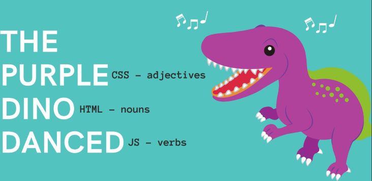
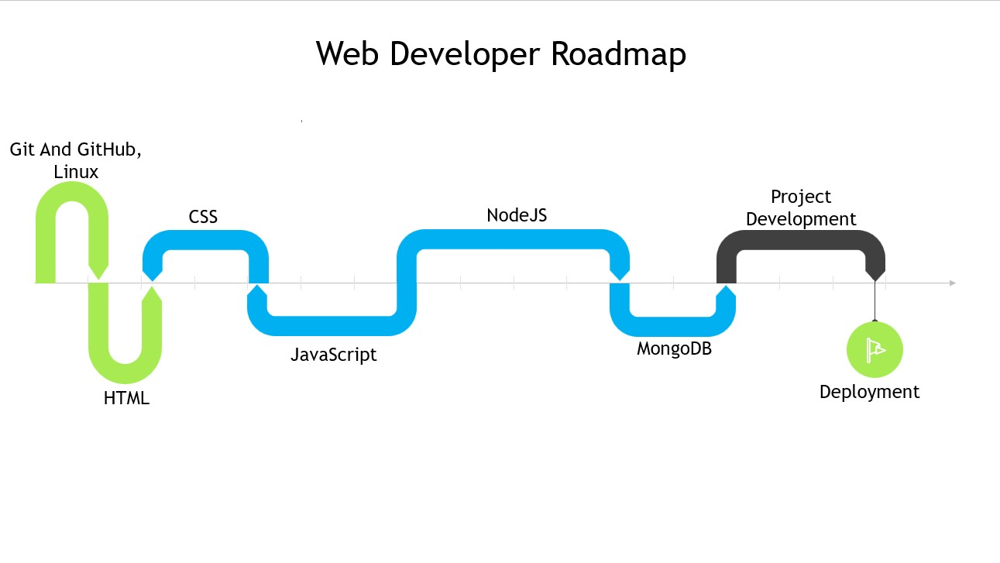

<!-- @format -->

# **Roadmap to Web Development**

## What Consists of The Web

- **Front End**
- **Back End**

> Let's think of it like a restaurant. We visit the restaurant and make an order,
> and the waiter comes and delivers the order. What we see and feel like decorations of the
> restaurant, taste of the food, etc. are like the front end of a website. We give orders to the waiter who can be compared to a server that accepts the request and gives us what we need. The back end can be compared to the kitchen where the food is being made by the chef.

## What to learn before starting Web Dev?

**1)** **Git And GitHub:**

> A version control system is essential for all kinds of developers. Version Control Systems help to manage your project and makes it easier for a team to collaborate on.

**2)** **Basic Linux Commands:**

> Some basic Linux or terminal commands that will make your work way faster
> than GUI-based interaction does.

**Resources:-**

[Kunal Kushwaha](https://youtu.be/apGV9Kg7ics)  
[BasicLinux](https://youtu.be/ZtqBQ68cfJc)

## **Front End**

### What exactly is Front End?

> Front End consists of everything we visually see and experience as a user.
> On the website things like the webpage you see the icons, the buttons, the scroll bar
>, etc are a part of the frontend.

## **Getting started in Front End**

{align=center}

Think of Front End as this elephant, the HTML tells us what it is. If we ask:
"what is it?" the answer is Dino. In the same way HTML decides the basic structure of the
page. It defines various things like buttons, paragraphs, headings, etc. on the page.

Whereas the CSS is like the adjective to the page. It tells us how the page is,
and how it looks. All the designing you see on a webpage is done by the CSS.

The javascript tells us what a particular thing on a webpage does.
To get started you just need to follow the below order

#### **HTML**

> Firstly learn HTML. It stands for HyperText Markup Language and it is pretty easy it will hardly take you a day or two to learn it. After learning this you'll be able to make basic structures of a webpage.

**_Resources for HTML_**

[Code With Harry](https://youtu.be/BsDoLVMnmZs)
[W3Schools](https://www.w3schools.com/html/)
[Programming With Mosh](https://youtu.be/qz0aGYrrlhU)

#### **CSS**

> I already talked about What is CSS. CSS Is a styling tool used for web pages. It is quite vast although you will only need to learn the basic part of it you can always come back and look on the docs for help.

**_resources for css_**

[FreeCodeCamp.org](https://youtu.be/OXGznpKZ_sA)
[HTML&CSS](https://youtu.be/G3e-cpL7ofc)

#### **JavaScript**

> If you are just starting programming this will be your first proper programming
> language. You will learn a lot of new concepts which might be overwhelming to you
> in the beginning but you need to be consistent. After this, you just need to
> integrate all three of them and you can start with your frontend development.
> (note: JS is also used in the backend)

**Libraries**

> Further you can learn different libraries in CSS and JS like SASS, Bootstrap, tailwind in CSS and React, or angular in JS.

Start making small front-end projects. Make a Clone of at least frontends of 5 popular sites

## **Back End**

### What is Back End?

> Let's Take an example, we all have used google so what you see on the front page,
> the logo the space where we type is the front end but what happens when you type
> something and hit enter? Well, this is where the backend comes into play. When you hit
> enter, a request is sent to the server, which then returns the search results. This
> action is done by the backend. The backend is where CRUD (Create, Read, Update, Delete)
> actions take place.

## **Getting started in Back End**

#### **NodeJS**

> It is a runtime environment where you can execute javascript. It provides a Server side solution.

**_Resources for NodeJS_**

[FreeCodeCamp](https://youtu.be/Oe421EPjeBE)

#### **MongoDB**

> Now you need to create a database in the backend to store useful information
> submitted by the user or provide data that the user has requested. A popular Database
> used here is MongoDB, A NoSQL Database so it is very scalable, updating and all
> things are quite easy here.

**_Resources for MongoDB_**
[Code With Harry](https://youtu.be/oSIv-E60NiU)

Now you can integrate it with your front-end clone projects and try to make their backends too by using dummy data sets.

### **Deploying the Website**

Now if you have made your web dev project and you want to deploy it. Use, AWS, Docker, git, etc. to Deploy.

## **FULL ROADMAP**

